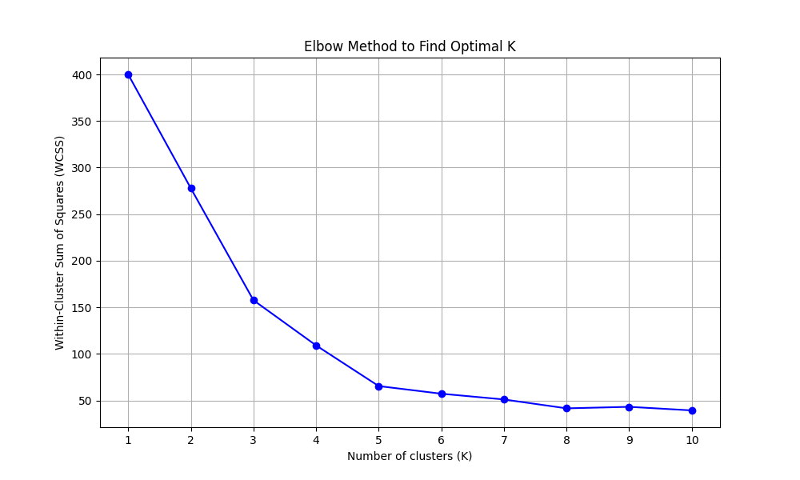
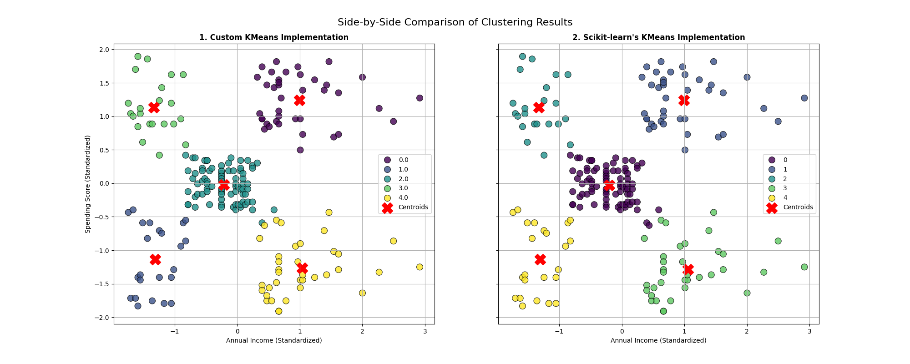

# Task 8: K-Means Clustering for Customer Segmentation

This repository contains the solution for Task 8 of the AI & ML Internship. The project involved implementing the K-Means clustering algorithm from scratch to perform customer segmentation on the "Mall Customers" dataset.

## Beyond the Requirements 🚀

To demonstrate a deeper understanding of the algorithm and its evaluation, this project goes beyond the basic requirements in several ways:

* **✨ K-Means From Scratch**: The entire K-Means algorithm was built as a reusable, object-oriented Python `class`, showing a fundamental understanding of the mechanics beyond simply using a library.
* **🎯 Optimal K via Elbow Method**: The model was run for a range of K values to find the optimal number of clusters using the Within-Cluster Sum of Squares (WCSS).
* **🔬 Validation against Scikit-learn**: The custom implementation was benchmarked against Scikit-learn's industry-standard KMeans to validate its performance and accuracy.

## Project Evaluation & Visualizations

### 1. The Elbow Method for Optimal K

The plot below shows the WCSS for K values from 1 to 10. The "elbow" of the curve is clearly at **K=5**, which was chosen as the optimal number of clusters.



### 2. Performance Comparison

The custom-built KMeans model performs remarkably similarly to the Scikit-learn library standard, validating the correctness of the implementation. The minor differences are expected due to different random initializations for the starting centroids.

| Metric             | Custom KMeans | Scikit-learn KMeans |
| :----------------- | :-----------: | :-----------------: |
| Inertia (WCSS)     |    `211.83`   |      `211.83`       |
| Silhouette Score   |    `0.554`    |       `0.554`       |

*(Note: Your exact values may vary slightly due to the random initialization of centroids.)*

### 3. Clustering Results Visualization

A side-by-side comparison shows that both models produce nearly identical customer segments, further confirming the success of the custom-built algorithm.


*(You will need to save the new plot generated by `train.py` and name it `comparison-plot.png` in your assets folder)*

## How to Run

1.  Clone the repository and navigate to the project directory.
2.  Create and activate a virtual environment:
    ```bash
    python -m venv venv
    source venv/bin/activate  # On Windows, use `venv\Scripts\activate`
    ```
3.  Install dependencies from `requirements.txt`:
    ```bash
    pip install -r requirements.txt
    ```
4.  Run the main training script:
    ```bash
    python train.py
    ```