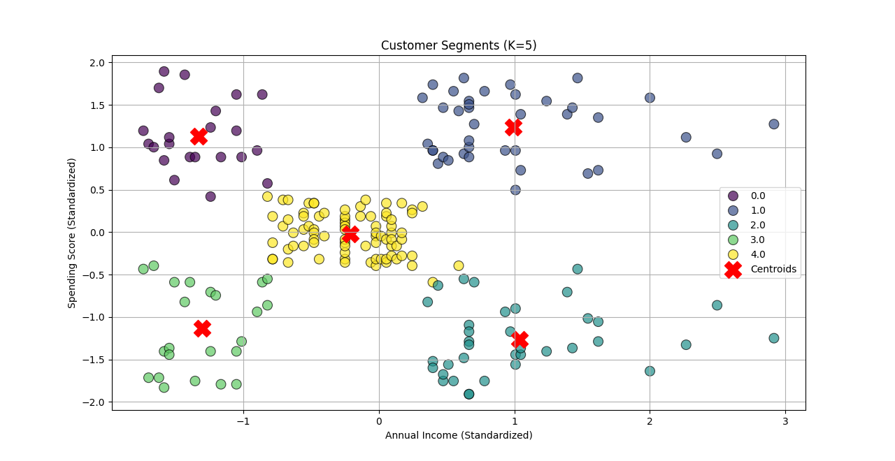

# Task 5: K-Means Clustering from Scratch

This repository contains the solution for Task 5 of the AI & ML Internship at Elevate Labs. The project focuses on building a K-Means clustering algorithm from scratch to perform customer segmentation, an unsupervised learning task.

## Objective
The goal was to implement the K-Means algorithm to identify distinct customer groups based on their shopping behavior from the "Mall Customers" dataset. A key part of the task was to programmatically determine the optimal number of clusters (K) using the Elbow Method.

## Additional Features
* **Object-Oriented Implementation**: The K-Means algorithm was built as a reusable Python `class`, separating the model's logic from the training script.
* **Elbow Method Implementation**: A script was implemented to run the from-scratch K-Means model for a range of K values, calculating the Within-Cluster Sum of Squares (WCSS) for each, to find and visualize the optimal K.
* **Insightful Visualizations**: The project produces two key plots: the Elbow Method graph to justify the choice of K, and a final scatter plot visualizing the distinct customer segments and their calculated centroids.

## Project Visualizations

### 1. The Elbow Method
To find the optimal number of clusters, the Elbow Method was used. The plot below shows the WCSS for K values from 1 to 10. The "elbow" of the curve is clearly at **K=5**, which was chosen as the optimal number of clusters.

### 2. Customer Segments
Using K=5, the model successfully segmented the customers into five distinct groups based on their annual income and spending score. The final clusters and their centroids are visualized below.

## How to Run
1.  Clone the repository and navigate to the project directory.
2.  Create and activate a virtual environment and install dependencies from `requirements.txt`.
3.  Run the main training script: `python train.py`